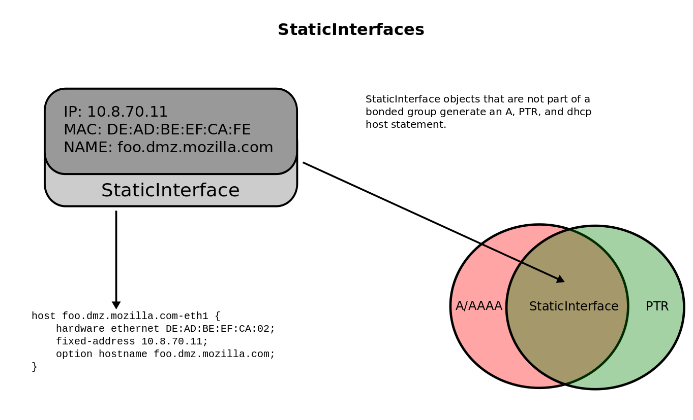
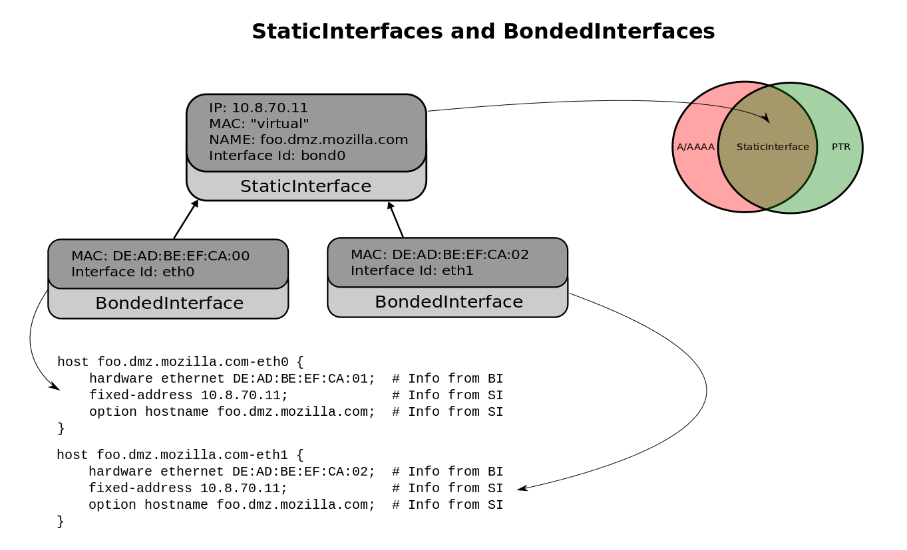

.. _staticinterface:

Static Interface
================
A static interface allows a user to easily create an A/AAAA :class:`AddressRecord` record,
:class:`PTR` record, and register the interface in the DHCP configs.

A static interface relys on having a ``hostname``, ``ip`` and a ``mac`` to
generates DNS and DHCP entries. The DNS entries are an A/AAAA record and a PTR record::

    <hostname>      A     <ip>
    <ip>            PTR   <hostname>

The DHCP entry is a host clause::

    host <hostname> {
        fixed-address <ip>;
        hardware ethernet <mac>;
    }

By choosing an ``ip`` you are in effect assigning the registration to a :class:`Range`.

Bonded Interfaces
=================
Context
+++++++
:class:`BondedInterface` (BI) objects are used to associate additional interfaces
with a StaticInterface (SI) without causing duplicate DNS data. They are usually
created when you want multiple DHCP host entries with the same hostname/ip but
with different MAC addresses.

As an example, consider a host with the following interfaces::

    bond0     Link encap:Ethernet  HWaddr DE:AD:DE:1C:BB:F0
              inet addr:10.8.70.11  Bcast:10.8.71.255  Mask:255.255.254.0
              inet6 addr: fe80::1ec1:deff:fe1c:bbf0/64 Scope:Link
              UP BROADCAST RUNNING MASTER MULTICAST  MTU:1500  Metric:1
              RX packets:85877116344 errors:5 dropped:15157 overruns:46564 frame:2
              TX packets:62006487356 errors:0 dropped:0 overruns:0 carrier:0
              collisions:0 txqueuelen:0
              RX bytes:59849245102449 (54.4 TiB)  TX bytes:82424119956913 (74.9 TiB)

    eth0      Link encap:Ethernet  HWaddr DE:AD:DE:1C:BB:F0
              UP BROADCAST RUNNING SLAVE MULTICAST  MTU:1500  Metric:1
              RX packets:44237521190 errors:5 dropped:7646 overruns:25957 frame:2
              TX packets:60693966456 errors:0 dropped:0 overruns:0 carrier:0
              collisions:0 txqueuelen:1000
              RX bytes:30151878107004 (27.4 TiB)  TX bytes:82190328597868 (74.7 TiB)
              Memory:fbe60000-fbe80000

    eth1      Link encap:Ethernet  HWaddr DE:AD:DE:1C:BB:F0
              UP BROADCAST RUNNING SLAVE MULTICAST  MTU:1500  Metric:1
              RX packets:41639595154 errors:0 dropped:7511 overruns:20607 frame:0
              TX packets:1312520900 errors:0 dropped:0 overruns:0 carrier:0
              collisions:0 txqueuelen:1000
              RX bytes:29697366995445 (27.0 TiB)  TX bytes:233791359045 (217.7 GiB)
              Memory:fbee0000-fbf00000

    lo        Link encap:Local Loopback
              inet addr:127.0.0.1  Mask:255.0.0.0
              inet6 addr: ::1/128 Scope:Host
              UP LOOPBACK RUNNING  MTU:16436  Metric:1
              RX packets:7319571905 errors:0 dropped:0 overruns:0 frame:0
              TX packets:7319571905 errors:0 dropped:0 overruns:0 carrier:0
              collisions:0 txqueuelen:0
              RX bytes:67705856863473 (61.5 TiB)  TX bytes:67705856863473 (61.5 TiB)

Also note the contents of ``/proc/net/bonding/bond0``::

    Ethernet Channel Bonding Driver: v3.6.0 (September 26, 2009)

    Bonding Mode: IEEE 802.3ad Dynamic link aggregation
    Transmit Hash Policy: layer2 (0)
    MII Status: up
    MII Polling Interval (ms): 100
    Up Delay (ms): 0
    Down Delay (ms): 0

    802.3ad info
    LACP rate: slow
    Aggregator selection policy (ad_select): stable
    Active Aggregator Info:
            Aggregator ID: 1
            Number of ports: 2
            Actor Key: 17
            Partner Key: 10
            Partner Mac Address: de:ad:1f:db:dc:80

    Slave Interface: eth0
    MII Status: up
    Speed: 1000 Mbps
    Duplex: full
    Link Failure Count: 0
    Permanent HW addr: de:ad:de:1c:bb:f0
    Aggregator ID: 1
    Slave queue ID: 0

    Slave Interface: eth1
    MII Status: up
    Speed: 1000 Mbps
    Duplex: full
    Link Failure Count: 0
    Permanent HW addr: de:ad:de:1c:bb:f1
    Aggregator ID: 1
    Slave queue ID: 0

Here there are three important objects: ``bond0``, ``eth0``, and ``eth1``. From
a DNS perspective this host would need one ``A`` record and one ``PTR`` record.
From a DHCP perspective this host would need two nearly identical ``host``
statements whose only difference would be the mac addresses specified by
``hardware ethernet``.  The near duplicate ``host`` statements are needed for
the situation when ``eth0`` fails and ``bond0`` begins using ``eth1``'s  mac
address.

Implementation
++++++++++++++
In Inventory, the relationship between a BondedInterface (BI) and a
StaticInterface (SI) is that of a many to one relationship; an SI can have
multiple BI's associated with it, but a BI is associated with exactly one SI.

In our example (shown in the figure above), ``bond0`` would be an SI object and
both ``eth0`` and ``eth1`` would be BI objects. ``bond0``'s SI object would be
the source of DNS information (like fqdn and ip address) and would have it's
mac address set to something like 'virtual' or 'bonded'. Two seperate BI
objects would represent ``eth0`` and ``eth1`` and would point to ``bond0``. The
BI's would be the source of the two different mac addresses used in the two
DHCP ``host`` statements.

Going from Static to Bonded
+++++++++++++++++++++++++++
If you need to coerce a StaticInterface into an SI that supports
BondedInterfaces, you can select that the SI supports BIs via the 'bonded
interface' checkbox. When you submit this change a new BI object will be
created and will automatically be associated with the original SI. Note that
the original SI *will* still exist and will continue to serve as the source of
DNS information.

Going from Bonded to Static
+++++++++++++++++++++++++++
Start over by deleting all BI objects and then delete the SI object.

Inferring an IP address for an Interface with it's Hostname
----------------------------------------------------------

Just by looking at an Interfaces requested hostname we can determine which site
(datacenter and possible business unit) and vlan an Interface is in. Using the
names of the site and vlan we can use information stored in the :ref:`core`
core of inventory to determine which IP address to choose for the interface.
For example::

        webnode1.webops.scl3.mozilla.com

This Interface is in scl3 in the webops vlan. Since Inventory tracks both sites
and vlans getting these objects is just a matter of querying the database.::

    site_scl3 = Site.objects.get(name='scl3')
    vlan_webops = Vlan.objects.get(name='webops')

Networks are associated to vlan's so retreving which networks are in the webops
vlan is one query away.::

    webops_networks = vlan_webops.network_set.all()

Since the webops vlan can exist in multiple datacenters, we only want to look
at networks that are in the webops vlan *and* are in scl3.::

    scl3_webops_networks = []
    for network in webops_networks:
        if network.site == site_scl3:
            scl3_webops_networks.append(network)

We now look for a free IP in a range in one of the networks in ``scl3_webops_networks``.

.. note::
    In most cases there is only one network associated with a vlan in a particular datacenter.

Getting a free ip is easy.::

    network = scl3_webops_networks[0]  # Let's just choose the first one for the sake of example.
    ip = None
    for range in network.range_set.all():
        ip = range.get_next_ip()
        if ip:
            break

We just found a free ip in vlan webops in scl3.

Static Interface
----------------
.. automodule:: core.interface.static_intr.models
    :inherited-members: StaticInterface
