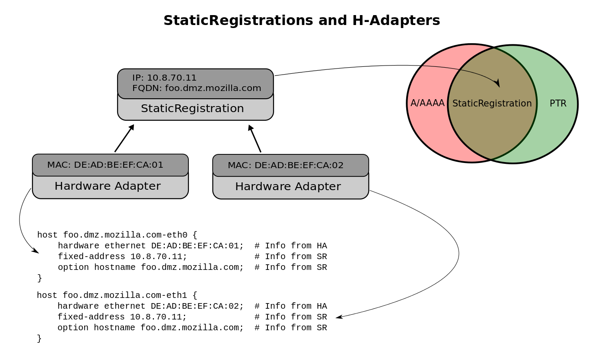

.. _staticreg:

Static Registration
===================
A static registration allows a user to easily create an :class:`AddressRecord`
record and a :class:`PTR` record. A static registration uses it's ``fqdn`` and
``ip_str`` to compose the ``A(AAAA)/PTR`` records.

When a :class:`HardwareAdapter` class references a :class:`StaticRegistration`
the result is a DHCP ``host`` statement. The ``host`` statement uses the
registration's ``fqdn`` as the ``option-hostname`` value and the
registration's ``ip_str`` as the ``fixed-address`` value. The ``hardware
ethernet`` value, and any other extra DHCP options, come from the
:class:`HardwareAdapter` instance.

.. note::
    Essentially, the Hardware Adapter is `enforcing` the registration and DHCP is
    the mechanism for how it does the enforcing. Why does this have to be DHCP?
    Puppet could do the enforcing and use Inventory as a source of truth.

Static Reg
==========
.. automodule:: core.registration.static_reg.models
    :inherited-members: StaticReg
